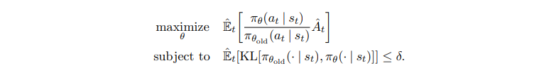
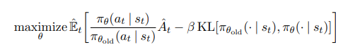
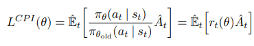
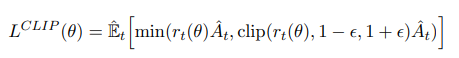
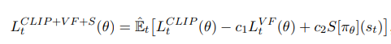
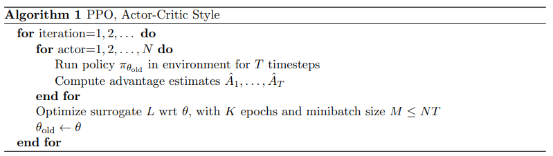
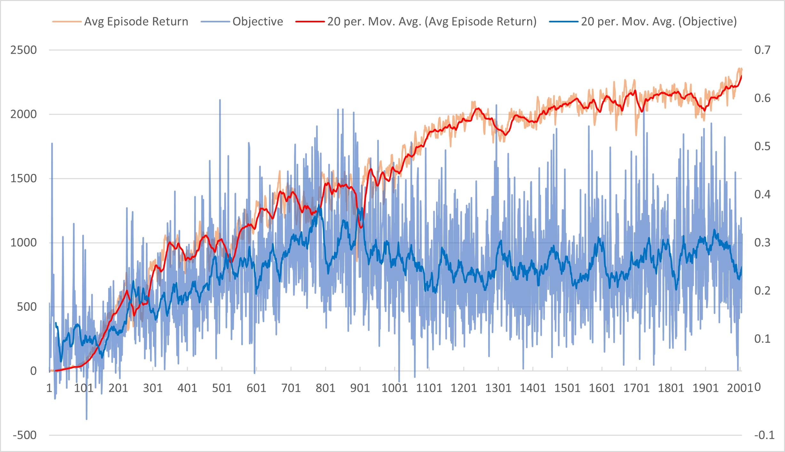

# Crawler Unity environment solution Report

This project implements a PPO to learn how to navigate within the environment and collect rewards.

## Environment particularities

Crawler is a four legged creature, with two joints per leg, which needs to learn how to keep it's balance and move as fast as possible in the forward direction. Unfortunately, as reward is also provided for looking in the right direction, so learning can have local maxima and the optimal solution not being found.

## Reinforcement Learning and Policy Gradient methods background

Reinforcement learning (RL) is one of the three basic machine learning paradigms, together with supervised learning and unsupervised learning. Whereas both supervised and unsupervised learning are concerned with finding an accurate system to predict an output given inputs, RL focuses on Markov Decision Processes (MDPs) and is concerned with the transition from states to states and the reward/cost associated with these transitions.  
This environment/agent interaction is depicted in below figure:


Basically, the agent and environment interact in a sequence of discrete time steps t. At each time step t, the agent receives some representation of the environment's state, S<sub>t</sub>&#8712;S, and on that basis selects an action, A<sub>t</sub>&#8712;A(S). At the next timestep t+1, in part as a consequence of its action, the agent receives a scalar reward, R<sub>t+1</sub>&#8712;&#8477;, as well as an new state S<sub>t+1</sub>. The MDP and agent together create a trajectory from an initial time step t over n transitions of states,actions,rewards, and next states as follows:


We represent the sum of rewards accumulated over a trajectory as . Clearly the limit of G<sub>t</sub> as the trajectory steps n increase is unbounded, so to make sure that we can have a bounded maximum total reward, we discount the rewards from the next transaction by a factor &gamma;&#8712;(0,1] with the case of γ=1 being useful only when a task is episodic, ie with a fixed number of transitions.
In the case that the sets S,R,and A are finite, then the MDP is finite and the following hold:
* Random variables  have well defined discrete probability distributions **depending only on the preceding state  & action **
* Given a random state s' ∈ S and reward r ∈ R the probability of s' and r occuring at time t given a preceding state s and action a is given by the four argument MDP <strong>dynamics function</strong> 
  
* Namely, given a state s and an action a, a probability can be assigned to reaching a state s' and receiving reward r, however the sum of these probabilities over all the possible next states and rewards is 1. That is:
  * 

From the <em>dynamics</em> function <em>**p**</em> we can derive other useful functions:
* <em>state transition probabilities</em> : 
* <em>expected rewards</em>: 

We define a policy, ), as a function  that produces an action a given a state s. Thus the expected rewards at a state s can be expressed as =r(s,\pi(s))=\mathbb{E}[R_t|S_{t-1}=s,A_{t-1}=\pi(s)]). This allows us to define the action-value function ), which defines the value of taking action a in state s under the policy π, and continuing the trajectory by taking following the policy π as follows:

[comment]: <> (%2B is plus sign)
[comment]: <> (%0A is line feed, %26 is &)


A fundamental property of the action value function is that it satisfies recursive relationships. That is, for any policy  and any state , the following consistency holds between the action value of ) and the action value of ():


The sum of probabilities over all possible next states s' and rewards r reflects the stochastisticy of the system. If we focus on a specific time-step t, then we can reformulate this with bootstrapping as follows:


When  is approximated as a non-linear function with a neural network with parameters θ, then we denote the action-value function as .
### Q - learning
In Q-learning, we consider that π is an optimal policy, that selects the next action based on the maximum q value of the future state. We learn the parameters of  through gradient descent, trying to fit the above function for a Bellmann error of 0. With a learning rate  the formula and gradient is thus:


### Deep Q Learning Networks
Mnih et al., in their [DQN](https://web.stanford.edu/class/psych209/Readings/MnihEtAlHassibis15NatureControlDeepRL.pdf) paper, used deep neural networks as a function approximator for the above Q-Learning.
Specifically, two Q-networks are trained by minimising a sequence of loss functions ) that changes at each iteration i. One Q-network has parameters  and is actively learning, while the second, target, Q-network has parameters  and it's parameters are gradually updated with the online's parameters. The loss function is thus:


### Policy Gradient methods

Finding the optimal policy with Q-learning is not trivial on continuous action spaces, since we would need to optimize the selected action at every timestep, requiring computation that will slow down our algorithm.
Instead, in [policy gradient methods](http://proceedings.mlr.press/v32/silver14.pdf?CFID=6293331&CFTOKEN=eaaee2b6cc8c9889-7610350E-DCAB-7633-E69F572DC210F301), the actor uses a learned policy function approximator  to select the best action. Learning what action is best given a state is done by maximizing the Q value for the state. Assuming we are sampling actions from a behavior  the objective of the actor becomes:


And the gradient wrt θ becomes:


Instead of using just Q, we can actually learn to select the action that would provide the greatest advantage. In this case, advantage being the difference between the next action value (Q) minus the value of the current state (V).

This would lead to a loss function as follows:


With the above refresher and definitions, we can move to the presentation of the algorithm implemented.

## Proximal Policy Optimization

In [TRPO](https://arxiv.org/pdf/1502.05477.pdf) the concept of maximizing a surrogate is introduced and the objective becomes as follows:


We can remove the constraint by including it as a penalty and write this as the unconstrained optimization problem:




The action probability of our policy with the new parameters over the action probability with the previous parameters can be written as r(θ).


TRPO thus maximizes the surrogate objective:



Proximal Policy Optimization Algorithm ([PPO](https://arxiv.org/abs/1707.06347)), by Schulman et. al., proposes to clip the loss as follows:



Since we try to learn both the value function (for estimating the advantage), as well as the policy, our loss function needs to take that into account. Furthermore, we want to make sure that our learned policy is as diverse as possible, so we give a bonus for the entry. As such, the overall loss on which we take the gradient is :



After sampling actions with the existing policy, the PPO algorithm uses this loss to optimize the θ parameters, with the below algorithm:



The above is implemented in our agent [ppo.py](agents/ppo.py) as follows:

```python

for policy_epochs in range(self.policy_optimization_epochs):
  idx = np.random.choice(n_samples, self.batch_size, replace=False)
  self.tot_epochs += 1
  # sample a batch
  with torch.no_grad():
      states = all_states[idx]
      actions = all_actions[idx]
      old_log_probs = all_old_log_probs[idx]
      returns = all_returns[idx]
      values = all_values[idx]
      gae = all_gae[idx]
  # get new predictions   
  values_pred, log_probs, entropy = self.policy.get_probs_and_value(states,actions)
  # compute value loss
  value_loss = F.smooth_l1_loss(values_pred, returns)
  # compute policy loss
  ratio = (log_probs - old_log_probs).exp()
  policy_objective = gae*ratio
  policy_objective_clamped = torch.where(gae > 0, (1+self.policy_clip_range) * gae, (1-self.policy_clip_range) * gae)
  policy_loss = -torch.min(policy_objective, policy_objective_clamped).mean()
  # compute entropy loss
  entropy_loss = -entropy.mean()
  # objective
  ppo_objective = policy_loss + self.vf_coeff*value_loss + self.entropy_coeff*entropy_loss
  # optimize PPO DNN
  self.policy_optimizer.zero_grad()
  ppo_objective.backward()
  nn.utils.clip_grad_norm_(self.policy.parameters(), self.policy_gradient_clip)
  self.policy_optimizer.step()
```

We would like to iterate over our samples as much as possible during a learning step, in order to get the most from these experiences, and reduce training time. However, during testing, we found that we can take too large steps in the wrong direction, so an 'early stop' mechanism was implemented according to the KL divergence. Specifically, the above `for` loop checks how far off our "old" policy is with regards to the learned one, and breaks as follows:


```python
with torch.no_grad():
  values, log_probs, _ = self.policy.get_probs_and_value(all_states,all_actions)
  kl = (all_old_log_probs - log_probs).mean()
  if kl > self.policy_stopping_kl: 
      break
```

## Plot of Rewards
With the above parameters, the agent was able to solve the game (average reward over 100 episodes >2000) in 1198 iterations.


Below is the 100 episode average reward per iteration, as well as the objective value per iteration.


